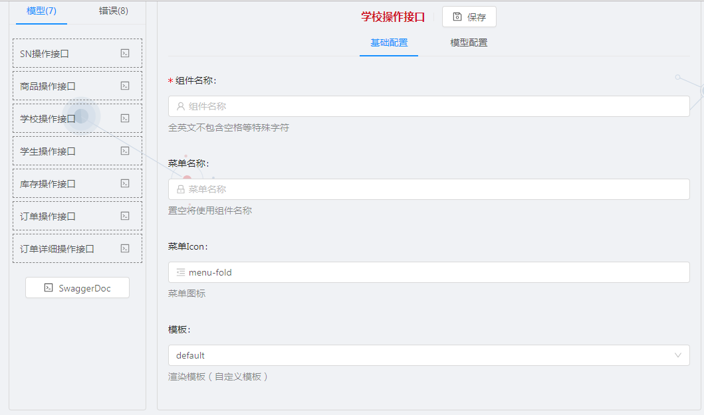
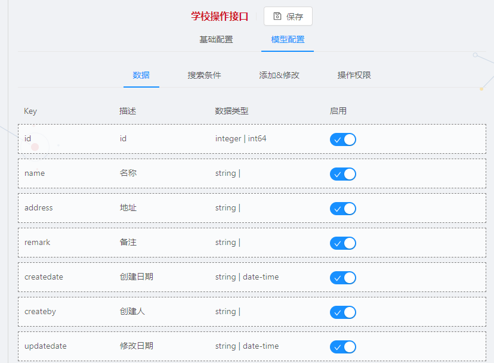
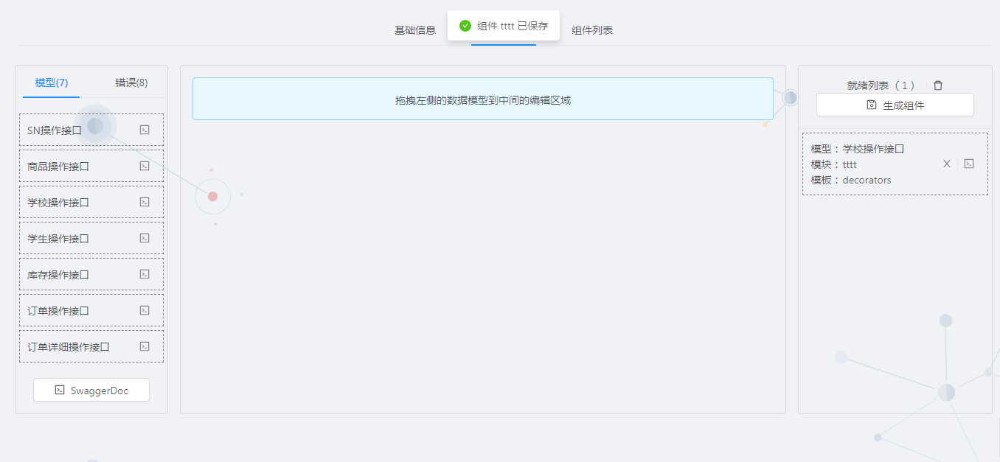
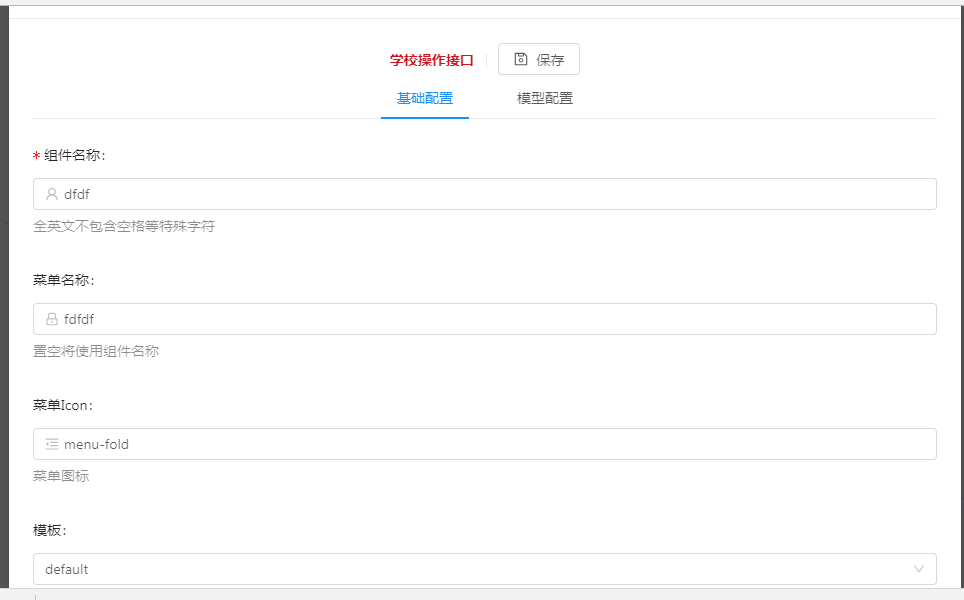

# 目录信息
    |-- config                                                  webpack 配置文件
    |   |-- basics.confit.js                                    基础配置
    |   |-- webpack.config.js                                   webpack跳转入口
    |   |-- webpack.deploy.js                                   deploy
    |   |-- webpack.dev.js                                      dev
    |-- src                                                     项目根目录
    |   |-- app                                                 app入口
    |   |   |-- layout                                          布局
    |   |   |-- pages                                           内置页面
    |   |   |   |-- home                                        首页
    |   |   |   |-- login                                       登陆
    |   |   |   |-- system                                      系统设置
    |   |   |-- index.tsx                                       入口文件
    |   |-- assets                                              静态资源
    |   |-- containers                                          容器组件
    |   |-- store                                               全局状态
    |   |-- utils                                               工具类
    |   |-- wtm                                                 核心文件
    |   |-- index.html                                          启动模板
    |   |-- index.manifest                                      离线存储文件（未启用）
    |   |-- index.tsx                                           启动入口
    |   |-- style.less                                          
    |   |-- typings                                             类型定以
    |   |-- wtmfront                                            wtm文件
    |   |   |--registerHelper                                   模板帮助方法
    |   |   |--swagger                                          swagger解析源码
    |   |   |--template                                         模板
    |-- package.json                 
    |-- tsconfig.json                                
    |-- webpack.config.js                                                                
    |-- wtmfront.json 

# 组件创建
## 组件信息
> 
- 组件名称:`生成组件的路由路径以及文件名`
- 菜单名称:`位于页面左侧菜单的名称`
- 菜单Icon:`左侧菜单的小图标,图标选择参照ant-design的Icon命名`
- 模板:`选择对应的模板`

## 模型配置
> 
- 数据:`选择table表格的columns`
- 搜索条件：`选择搜索条件`
- 添加&修改:`选择table的编辑权限`
- 操作权限:`对应功能按钮的权限`

## 组件生成
!> 可一次性生成多个组件。

> 

## 组件修改
> 

