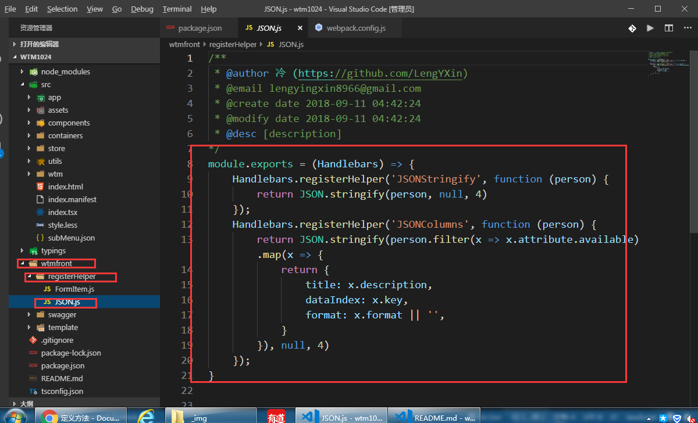

### 模板数据
```
  <!-- 目前可用数据 -->

        idKey: "id",    //唯一标识
        address: "",    //模型控制器
        columns: [],    //teble 列
        search: [],     //搜索条件
        install: [],    //添加字段
        update: []      //修改字段
        pageButtons:{
            /** 添加按钮 */
            install: boolean,
            /** 添加修改 */
            update: boolean,
            /** 删除按钮 */
            delete: boolean,
            /** 导入按钮 */
            import: boolean,
            /** 导出按钮 */
            export: boolean
        }
```
### 解析方法
!> **模板解析数据 {{{ <解析方法> <数据Key> }}}**
```
    import { action, observable, runInAction, toJS } from "mobx";
    import { HttpBasics } from "core/HttpBasics";
    import { message } from "antd";
    import storeBasice from 'core/storeBasice';
    export class Store extends storeBasice {
        constructor() {
            super({
                // api 地址前缀
                address: '{{{ address }}}'
            });
        }
        /** 数据 ID 索引 */
        IdKey ='{{{ idKey }}}';
        /** table 列配置  title dataIndex 必备字段 其他为api 返回默认字段*/
        columns = {{{JSONColumns columns }}}
    }
    export default new Store();
```
!> **解析后的数据:**
```
  import { action, observable, runInAction, toJS } from "mobx";
    import { HttpBasics } from "core/HttpBasics";
    import { message } from "antd";
    import storeBasice from 'core/storeBasice';
    export class Store extends storeBasice {
        constructor() {
            super({
                // api 地址前缀
                address: '/corp/'
            });
        }
        /** 数据 ID 索引 */
        IdKey ='id';
        /** table 列配置  title dataIndex 必备字段 其他为api 返回默认字段*/
        columns = [
            {
                "title": "公司ID",
                "dataIndex": "id",
                "format": ""
            },
            ......
        ]
    }
    export default new Store();
```
### 自定义方法
!> **{{{JSONColumns columns }}} 中的 JSONColumns**
```
  // registerHelper 接受2个参数  解析函数名称 （JSONColumns） & 解析 方法回调 返回解析后数据
    // person 为 传入的 数据原型 （swagger 解析的 columns 字段数据）
    Handlebars.registerHelper('JSONColumns', function (person) {
        return JSON.stringify(person.filter(x => x.attribute.available).map(x => {
            return {
                title: x.description,
                dataIndex: x.key,
                format: x.format || '',
            }
        }), null, 4)
    });
```
!> 文件所在路径：
