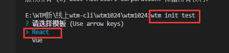
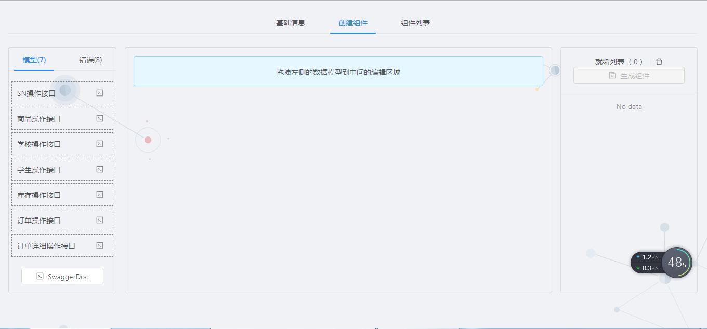

## **安装 cli**
```
	$ npm install -g wtm-cli
```
## **初始化项目**
```
	$ wtm init <project-name>
```

## **启动项目**
```
	$ npm run start
```
## **启动模板服务**
```
	$ npm run wtm
```

## **构建项目**
```
	$ npm run build
```
