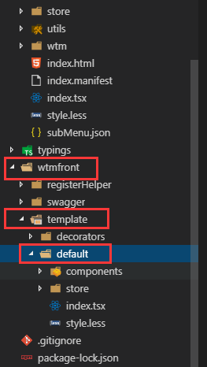

## 功能重写
!> **所创组件的模板的store都继承至基类**

!> **继承的store支持重写但不能重载,且可以新建**

!> **重写方法时，请遵循TypeScript规范**
### 重写
!> **原方法:**
```javascript
async onDelete(params: any[]) {
    params = params.map(x => x[this.IdKey])
    const method = this.Urls.delete.method;
    const src = this.Urls.delete.src;
    const res = await this.Request[method](src, params).toPromise()
    if (res) {
      message.success('删除成功')
      this.onSelectChange([]);
      // 刷新数据
      this.onSearch();
    } else {
      message.success('删除失败')
    }
    return res
  }

```

!> **重写后:**
```javascript
 //重写删除
  @action.bound
  async onDelete(params: any[]) {
    const method = this.Urls.delete.method;
    const src = this.Urls.delete.src;
  //  const res = await this.Request[method](src, params).toPromise()
    if (true) {
      message.success('删除成功')
      this.onSelectChange([]);
      // 刷新数据
      //this.onSearch();
      //本地删除  
     runInAction(()=>{
       this.dataTT.list = this.filterData(params, this.dataTT.list)
      })
    } else {
      message.success('删除失败')
    }
    //return result
  }
```
### 新增
```javascript
 //新增操作
   @action.bound
   onAdd(record){
     if(record){
       this.record=record
     }else{
       this.addAll=true;
       this.record=this.dataTT.list.slice()
     }
     this.onModalShow({})
    
   }
   //修改操作
   @action.bound
   onUp(record){
     this.record=record
     this.onModalShow(record)
   }


```

## 结构重写

!> **组件结构继承至 "wtm/components/table"**

!> **框架依赖于React,且支持ant-design**

!> **继承的结构:**
```javascript
render() {
    const dataSource = this.Store.dataSource;
    /**
    * 行选择
    */
    const rowSelection = {
      selectedRowKeys: this.Store.selectedRowKeys,
      onChange: e => this.Store.onSelectChange(e),
    };
    const columns = this.Store.SwaggerModel.columns.slice();
    columns.push({
      title: 'Action',
      dataIndex: 'Action',
      render: this.renderAction.bind(this),
    })
    return (
      <Row ref={e => this.rowDom = ReactDOM.findDOMNode(e) as any}>
        <Divider />
        <Table
          bordered
          components={this.components}
          dataSource={dataSource.list.slice()}
          onChange={this.onChange.bind(this)}
          columns={columns}
          rowSelection={rowSelection}
          loading={this.Store.pageState.loading}
          pagination={
            {
              // hideOnSinglePage: true,//只有一页时是否隐藏分页器
              position: "top",
              showSizeChanger: true,//是否可以改变 pageSize
              pageSize: dataSource.pageSize,
              defaultPageSize: dataSource.pageSize,
              defaultCurrent: dataSource.pageNo,
              total: dataSource.count
            }
          }
        />
      </Row>
    );
  }

```

!> **重写后:**
```javascript
render(){
      console.log(this.initData(this.dataSource.slice()))
        const dataSource = this.Store.dataTT;

        const rowSelection = {
           selectedRowKeys: this.Store.selectedRowKeys,
            onChange: e => this.Store.onSelectChange(e),
          };
          const columns = this.Store.columns.slice();
          columns.push({
            title: 'Action',
            dataIndex: 'Action',
            render: this.renderAction.bind(this),
          })
          columns[0].width="30%"
        return (
            <Table
            expandedRowKeys={this.props.Store.expandedRowKeys.slice()}
            onExpand={this.props.Store.onExpand}
            bordered
            dataSource={dataSource.list.slice()}
            onChange={this.onChange.bind(this)}
            columns={columns}
            rowSelection={rowSelection}
            loading={this.Store.pageState.loading}
            // pagination={
            //   {
            //     // hideOnSinglePage: true,//只有一页时是否隐藏分页器
            //     position: "top",
            //     showSizeChanger: true,//是否可以改变 pageSize
            //     pageSize: dataSource.pageSize,
            //     defaultPageSize: dataSource.pageSize,
            //     defaultCurrent: dataSource.pageNo,
            //     total: dataSource.count
            //   }
            // }
          />
        )
    }

```

## 样式修改

!> **样式修改建议结合ant-design自带的类名来修改**

## 模板创建

!> **模板生成组件组件规则:框架会将模板的文件复制一份到"src/containers"里,其中带有模板语法的会解析,其余不变**

!> **模板中报错可忽略,模板的所有代码都只需考虑在"src/containers"中是否符合标准即可**

?> 模板编写目录:"wtmfront/template"


